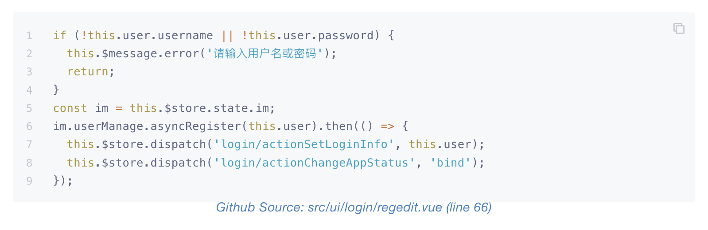

# Embed Code Snippets into Gitbooks

Just fill in the repository name, class name and function name, this plugin will automatically search the github repository to generate code snippets that call this function。 Support C/C++/Java/Javascript/Objective-C languages.


Using this tag ``, it will generate the code snippet as shown below:


## Prerequisites
[Joern](https://github.com/joernio/joern) needs to be installed.

You can install [Joern](https://github.com/joernio/joern) according to [this document](https://docs.joern.io/installation)

## Installation
Add the following plugins to your book.json and run gitbook install

{
    "plugins": ["lanying-code-snippet"]
}

## Usage
Configuration option can be set as an obj like:
```
{
    "plugins": [
        "lanying-code-snippet"
    ],
    "pluginsConfig": {
        "lanying-code-snippet": {
            "showLink": true,
            "reindent": true,
            "maxLine": 20,
            "maxSnippetCount": 10,
            "repositories": [
                {
                    "name":"lanying-im-web",
                    "url":"https://github.com/maxim-top/lanying-im-web.git",
                    "branch":"master"
                },
                {
                    "name":"lanying-im-android",
                    "url":"https://github.com/maxim-top/lanying-im-android.git",
                    "branch":"master",
                    "cacheDir": "../cache/lanying-im-android"
                }
            ]
        }
    }
}
```
## Configuration

* `showLink=true` Show a link below the embedded source back to the source file. Defaults to `true`
* `reindent=true` Re-indent the lines given the line numbers. Defaults to `true`
* `maxLine=20` maximum number of lines each code snippet. Defaults to `20`
* `maxSnippetCount=10` Maximum number of code snippets. Defaults to `10`
* `repositories` repositories are used to configure github repository information.
  - `repositories[*].url` is the url of github repository.
  - `repositories[*].branch` is the branch of github repository.
  - `repositories[*].name` is the name of github repository.
  - `repositories[*].cacheDir` is the cache dir of github repository. If not set, a random directory under /tmp will be used。If set, the set directory will be used. if the language is Objective-C, cacheDir must be set.
* Using the tag `` to generate the code snippets, the `repo` is the name of github repository, must be one of  `repositories[*].name`, the `class` is the class name, the `function` is the function name.

## Styling the Link

Use a gitbook style override to adjust the style of the link. The class is [`.lanying-code-snippet-caption`](https://github.com/maxim-top/gitbook-plugin-lanying-code-snippet/blob/master/book/lanying-code-snippet.css).

## Objective-C language
If the code is write in Objective-C language, Xcode version less than 12 is needed. [llvm2cpg](https://github.com/ShiftLeftSecurity/llvm2cpg) is also needed.
Must ensure the following command must execute successfully in the repo cache dir.
```
xcodebuild OTHER_CFLAGS='-fembed-bitcode -grecord-command-line -fno-inline-functions -fno-builtin' OTHER_CPLUSPLUSFLAGS='-fembed-bitcode -grecord-command-line -fno-inline-functions -fno-builtin' OTHER_LDFLAGS='-fembed-bitcode -grecord-command-line -fno-inline-functions -fno-builtin' clean build && llvm2cpg `find . -name '*.o'`
```
## FAQ
* When gitbook install report `Error: spawn E2BIG`, should rerun gitbook install command.